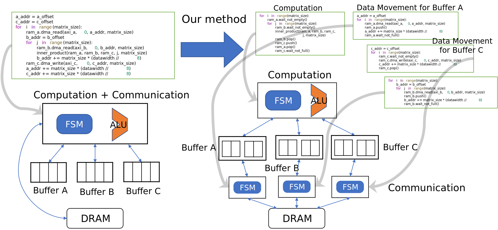
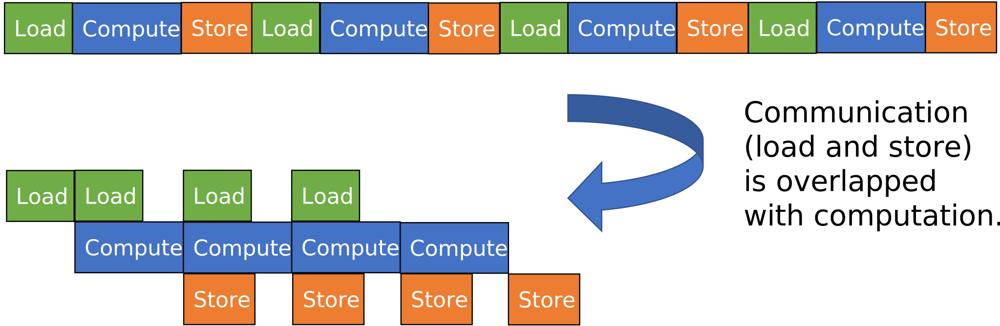

# ご挨拶
こんにちは。東京大学でコンピュータサイエンスを専攻している薄井真之です。このサイトは私の履歴書として機能することを意図しています。

# 学歴
- 2025年3月 東京大学 大学院情報理工学系研究科 コンピュータ科学専攻修士課程 修了（予定）
- 2023年4月 東京大学 大学院情報理工学系研究科 コンピュータ科学専攻修士課程 入学（予定）
- 2023年3月 東京大学 理学部 情報科学科 卒業
- 2021年4月 東京大学 理学部 情報科学科 進学
- 2021年3月 東京大学 教養学部前期課程 理科一類 修了
- 2019年4月 東京大学 教養学部前期課程 理科一類 入学

# ポートフォリオ
## 卒業研究
提案手法ではコードを計算とデータ移動に分離し、それぞれを高位合成でハードウェアにします。

計算とデータ移動が別々に行われていることが嬉しい理由は、計算と通信（データ移動）がオーバーラップすることで、総実行時間が減少するためです。

こちらの内容を国内の研究会で発表しました。
- [電気情報通信学会のページ](https://ken.ieice.org/ken/paper/20230302YCT4/)
- [発表のスライド](https://mu2519.github.io/cv/vld_slides.pdf)

## 高位合成ツールの改良
高位合成ツールである[Veriloggen](https://github.com/PyHDI/veriloggen)の改良に取り組んでいます。

### ASICの対応
現在[feature-asicブランチ](https://github.com/mu2519/veriloggen/tree/feature-asic)で公開されています。

行列積の計算を行うハードウェアを合成するノートブックを公開しています。

### DSPの最適化
現在[feature-dspブランチ](https://github.com/mu2519/veriloggen)で公開されています。
